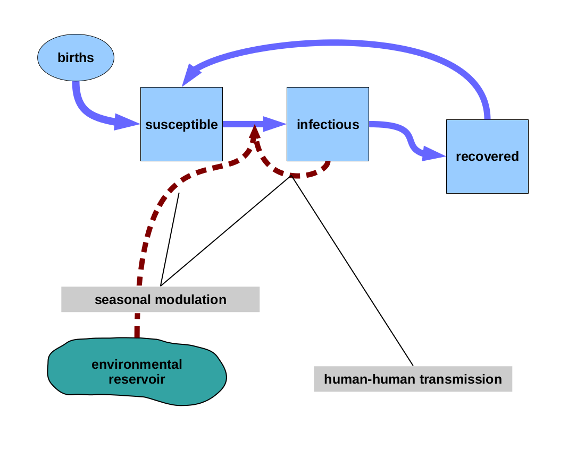
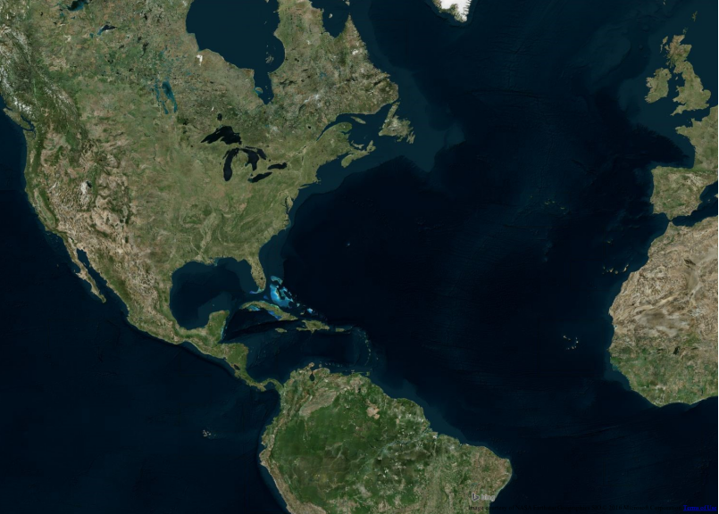
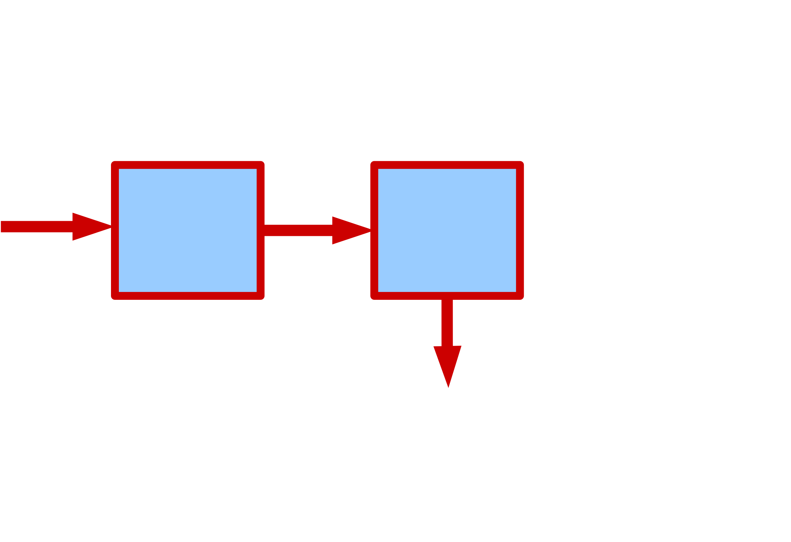

```{r knitr-opts,include=FALSE,purl=FALSE,cache=FALSE}
source("../_includes/setup.R", local = knitr::knit_global())
knitr::opts_chunk$set(echo=FALSE)
```
```{r prelims,include=FALSE,cache=FALSE}
set.seed(594709947L)
library(tidyverse)
library(scales)
library(cowplot)
theme_set(theme_bw())
library(grid)
library(foreach)
library(bbmle)
library(pomp)
```

## Models have many uses in ecology

- Organizing data
- Developing theoretical principles
- Exploring hypotheticals
- Explaining observed patterns
- Guiding policy
- Making forecasts

## The dialogue between scientist and Nature

- We have questions about the causes of things...
- ...but Nature does not answer our questions directly.
- We must propose hypothetical answers to our questions.

## The dialogue between scientist and Nature

- We have questions about the causes of things...
- ...but Nature does not answer our questions directly.
- We must propose hypothetical answers to our questions.
- Models are nothing other than hypothetical answers to questions we ask.
- Models are necessarily *partial* answers, at best.


## The dialogue between scientist and Nature

- It is relatively easy to ask difficult questions.
- It is harder, but still relatively easy, to propose creative hypothetical answers.

## The dialogue between scientist and Nature

- It is relatively easy to ask difficult questions.
- It is harder, but still relatively easy, to propose creative hypothetical answers.
- It is often much more difficult to hear what the data have to say.

## The dialogue between scientist and Nature

- It is relatively easy to ask difficult questions.
- It is harder, but still relatively easy, to propose creative hypothetical answers.
- It is often much more difficult to hear what the data have to say.
- Before the data will give a response, they must be asked in the proper way.
- Their responses are always equivocal, but some answers are better than others.
- One difficulty: how do we quantify this?
- Another difficulty: the answer we get depends on the question we ask.  
  How do we avoid misunderstanding the reply?


## Mechanistic models as scientific instruments

In seeking to *understand* biological phenomena, models are tools for looking at the data.

They focus attention on the discrepancies between our hypotheses and reality.

How to quantify these discrepancies?

<!-- The key principle of statistics is that we must *model the error*. -->

## Quantifying discrepancy between model and data

```{r discrep1}
library(pomp)
bsflu |>
  select(day,B) |>
  trajectory(
    times="day",t0=0,
    params=c(
      mu_IR=1/3,
      Beta=1.4,Beta_sd=0,
      pop=1400,
      rho=0.9,sigma=3.6,
      S_0=0.999,I_0=0.001,R_0=0
    ),
    skeleton=vectorfield(Csnippet("
      double rate[2];           // transition rates
      double term[2];           // transition numbers
      // compute the transition rates
      rate[0] = Beta*I/pop;   // force of infection
      rate[1] = mu_IR;              // recovery
      // compute the several terms
      term[0] = rate[0]*S;
      term[1] = rate[1]*I;
      // balance the equations
      DS = -term[0];
      DI = term[0]-term[1];
      DH = DR = term[1];
      DW = 0;                   // no noise, so no noise accumulation"
    )),
    rinit=Csnippet("
      double m = pop/(S_0+I_0+R_0);
      S = nearbyint(m*S_0);
      I = nearbyint(m*I_0);
      R = nearbyint(m*R_0);
      H = 0;
      W = 0;"
    ),
    dmeasure=Csnippet("
      lik = dnbinom_mu(B,1/sigma/sigma,rho*H,give_log);"
    ),
    statenames=c("S","I","R","H","W"),
    paramnames=c(
      "mu_IR","Beta","Beta_sd","pop","rho","sigma",
      "S_0","I_0","R_0"
    ),
    accumvars="H"
  ) -> bbs
```

```{r discrep2,out.width="80%"}
bbs |>
  as.data.frame() |>
  mutate(
    xlab=sprintf("hat(y)[%d]",day),
    ylab=sprintf("paste(y[%d],'*')",day)
  ) |>
  ggplot(mapping=aes(x=day,xend=day))+
  geom_point(aes(y=B),color='black',alpha=0.5)+
  geom_point(aes(y=H),color='red',alpha=0.5)+
  geom_line(aes(y=B),color='black',alpha=0.5)+
  geom_line(aes(y=H),color='red',alpha=0.5)+
  geom_text(aes(y=B,label=ylab,vjust=ifelse(day>=10,2,-1)),parse=TRUE,color='black')+
  geom_text(aes(y=H,label=xlab,vjust=ifelse(day>=10,-1,2)),parse=TRUE,color='red')+
  geom_segment(aes(y=H,yend=B),color='blue',linetype=2,alpha=0.3,
               arrow=grid::arrow(length=grid::unit(0.02,"npc")))+
  labs(y="") -> pl
pl+expand_limits(y=c(-30,330))
```

## Quantifying discrepancy between model and data

```{r discrep3,out.width=600}
pl+scale_y_log10()+expand_limits(y=c(0.2,700))
```

## Quantifying discrepancy between model and data

- The natural and optimal quantification is in terms of *surprise*: $-\log{p}$
- A better answer is one in which the data are less surprising.
- In this view, a model must be *generative* before Nature will respond.
- Thus, properly speaking, a model is a *probability distribution*.
- We must model the *noise* and the *error*.

## Mechanistic models as scientific instruments

- In seeking to infer causal mechanism in *intact* biological systems, *dynamics* are especially informative.
- Hypotheses about causal mechanisms can often readily be formalized as dynamical systems models.
- The problems of inference
    - How can we estimate unknown parameters?
    - How can we decide among competing models?
    - How can we extract maximum information from time series data?
- When do we know when we need a better model vs better data?

## Overview

1. Markov models
1. Examples: cholera and pertussis
1. Partially observed Markov processes
1. Plug and play inference methods
1. Plug and play methods in practice
1. Conclusions and recommendations

## Endemic cholera

What are the roles of seasonal and decadal climate drivers in the epidemiology of cholera?

What is the best vaccination strategy?

## Endemic cholera


## Endemic cholera


## Endemic cholera


## Endemic cholera


## Endemic cholera


## Endemic cholera

```{r cholera_plot,out.width="80%"}
read_csv("data/IndiaCholera.csv") -> IndiaCholera
IndiaCholera |> 
  filter(
    district %in% c("Midnapore","Dacca","Jalpaiguri"),
    district != "Jalpaiguri" | year>1893
  ) |>
  ggplot(aes(x=date,y=cholera.deaths,group=district))+
  geom_line()+
  # scale_y_continuous(trans="sqrt")+
  facet_grid(district~.,scales="free_y")+
  # theme_classic()+
  theme(strip.background=element_blank())+
  labs(x=NULL,y="cholera deaths per month")
```

## Questions

1. Roles of seasonal and decadal climate drivers
    - complex seasonality
    - multiennial cycles
1. Importance of bacteriophage in environment
1. Relative importance of human-human vs environmental transmission
1. Durations of vaccine- and infection-induced immunity


## Transmission models for endemic cholera


## Transmission models for endemic cholera


## Transmission models for endemic cholera


## Transmission models for endemic cholera


## Transmission models for endemic cholera



## Transmission models for endemic cholera


## Transmission models for endemic cholera


## Transmission models for endemic cholera

A large family of models:

- How well do each of the models explain the data?
- What insights can we gain into the system's dynamic self-regulation?

These questions involve inescapable technical complications:

- nonlinearity
- stochasticity
- nonstationarity
- time-varying parameters

## Questions

1. Roles of seasonal and decadal climate drivers
    - complex seasonality
    - multiennial cycles
1. Importance of bacteriophage in environment
1. Relative importance of human-human vs environmental transmission
1. Durations of vaccine- and infection-induced immunity


## The ongoing pertussis resurgence

  
[@Lavine2011]

## The ongoing pertussis resurgence

  
[@DomenechdeCelles2016]


## Question

Why is pertussis resurgent?

Hypothetical answers include:

- Changes in vaccine efficacy
- Vaccine-driven pathogen evolution
- Increased circulation of congeneric pathogens
- Asymptomatic transmission
- Loss of natural immune boosting
- Increased surveillance sensitivity

## Key unknowns

- durability of vaccine-induced immunity
- relative efficacy of natural- and vaccine-derived immunity

## Modes of vaccine failure

  

$$\lambda(I_1,I_2,t) = \frac{\beta(t)\,(I_1+\theta\,I_2)+\bar{\beta}\,\iota}{N}$$

Post-vaccination infections are observed at a reduced rate, $\eta$.

[@Magpantay2016]

## Modes of vaccine failure

  

- Can we estimate the nature and durability of vaccine-induced protection?
- Which models explain the data adequately?

[@Magpantay2016]

## Pertussis resurgence in progress


## Pertussis resurgence in progress



## Pertussis resurgence in progress


## Pertussis resurgence in progress


## Pertussis resurgence in progress


## Pertussis resurgence in progress


## Pertussis in Massachusetts


[@DomenechdeCelles2018]

## Modes of vaccine failure

  

## Modes of vaccine failure

  

[@DomenechdeCelles2018]

## Time-varying vaccination rates


[@DomenechdeCelles2018]

## Time-varying demographic rates


[@DomenechdeCelles2018]

## Age-specific contact rates


[@Rohani2010a;@DomenechdeCelles2018]

## Age-specific contact rates


[@Mossong2008;@Fumanelli2012]


## Modes of vaccine failure

  

- Can we estimate the nature and durability of vaccine-induced protection?
- Which models explain the data adequately?
- Questions of parameter estimation and model selection

[@DomenechdeCelles2018]

## Sources of error

The key principle is that we must model the error.

- Measurement error
	- Error
	- Finite precision
- Process noise
    - Environmental trends and fluctuations
    - Unmodeled heterogeneities
    - Model misspecification
    - Unmodeled variables

<!-- ## Stochastic models -->

<!--  -->

<!-- ## Stochastic models -->

<!--  -->

<!-- ## Stochastic models -->

<!--  -->

<!-- ## Stochastic models -->

<!--  -->

<!-- ## Stochastic models -->

<!--  -->

<!-- ## Stochastic models -->

<!--  -->

<!-- $$ -->
<!-- \begin{aligned} -->
<!-- N_{\emptyset{X}}(t)&=\text{cumulative number of births into X by time $t$}\\ -->
<!-- N_{XY}(t)&=\text{cumulative number of X $\to$ Y movements by time $t$}\\ -->
<!-- N_{Y\emptyset}(t)&=\text{cumulative number of Y $\to$ $\emptyset$ movements by time $t$}\\ -->
<!-- \end{aligned} -->
<!-- $$ -->

<!-- ## Stochastic models -->

<!--  -->

<!-- $$ -->
<!-- \begin{aligned} -->
<!-- dN_{\emptyset{X}}&=B(t)\,dt \phantom{+\sigma_1(t)\,dW_1(t)}\\ -->
<!-- dN_{XY}&=\lambda(Y)\,X\,dt \phantom{+\sigma_2(X,Y)\,dW_2(t)}\\ -->
<!-- dN_{Y\emptyset}&=\mu\,Y\,dt \phantom{+\sigma_3(Y)\,dW_3(t)}\\ -->
<!-- \end{aligned} -->
<!-- $$ -->

<!-- ## Stochastic models -->

<!--  -->

<!-- $$ -->
<!-- \begin{aligned} -->
<!-- dN_{\emptyset{X}}&=B(t)\,dt +\sigma_1(t)\,dW_1(t)\\ -->
<!-- dN_{XY}&=\lambda(Y)\,X\,dt +\sigma_2(X,Y)\,dW_2(t)\\ -->
<!-- dN_{Y\emptyset}&=\mu\,Y\,dt +\sigma_3(Y)\,dW_3(t)\\ -->
<!-- \end{aligned} -->
<!-- $$ -->

<!-- $$dW_i\;\stackrel{i.i.d}{\sim}\;\mathrm{Normal}(0,\sqrt{dt})$$ -->

<!-- ## Stochastic models -->

<!--  -->

<!-- $$ -->
<!-- \begin{aligned} -->
<!-- dX&=B(t)\,dt-dN_{XY}\\ -->
<!-- &=B(t)\,dt-\lambda(Y)\,X\,dt+\sigma_1(t)\,dW_1(t)-\sigma_2(X,Y)\,dW_2(t)\\ -->
<!-- dY&=dN_{XY}-dN_{Y\emptyset}\\ -->
<!-- &=\lambda(Y)\,X\,dt+\sigma_2(X,Y)\,dW_2(t)+\sigma_3(X)\,dW_3(t)\\ -->
<!-- \end{aligned} -->
<!-- $$ -->

## Partially observed Markov processes

  
[@King2016]

## Partially observed Markov processes

  
[@King2016]

## Partially observed Markov processes

  
[@King2016]

## Partially observed Markov processes

  
[@King2016]

## Partially observed Markov processes

  
[@King2016]

## Partially observed Markov processes

```{tikz pomp_schematic,fig.ext="png",out.width="90%"}
\input{../graphics/state_space_diagram2}
```

## The &ldquo;plug-and-play&rdquo; property

Definition: an algorithm has the *plug-and-play property* if it has no need to compute the latent process transition density.

Plug-and-play methods access the latent process model only via simulation.

This puts essentially no restrictions on the form of the models that can be entertained.

They are also called "simulation-based" methods.

[@He2010;@King2016]

## Simulation-based inference methods

- Feature-based methods
    - Approximate Bayesian computation (ABC)
    - Nonlinear forecasting (NLF)
    - Attractor-reconstruction-based methods
    - Probe matching
    - Synthetic likelihood
- Full-information methods (likelihood based)
    - Sequential Monte Carlo (the particle filter)
    - Particle Markov chain Monte Carlo
    - Iterated filtering

Variants of all of these are available in the **pomp** software package (King et al. 2016; [https://kingaa.github.io/pomp/]) and elswhere.


## Pertussis and vaccine failure

  

$$\lambda(t) = \frac{\beta(t)\,(I_1+\theta\,I_2)+\bar{\beta}\,\iota}{N}$$

Post-vaccination infections are observed at a reduced rate, $\eta$.

[@Magpantay2016]

## Profile likelihood

  

Interpretation: in vaccinated hosts, infections are mild to asymptomatic, yet equally infectious


## Limits to information


Flat profiles indicate lack of information in the data relative to the question.

In effect, the data refuse to answer the question.

[@Magpantay2016]


## Endemic cholera

  
[@King2008]

## Profile likelihood

```{r dacca-profile1,out.width="80%"}
read.csv("data/mle.csv") |>
  filter(dataset=="Dacca") |>
  mutate(
    fatality=clin*deltaI/(delta+deltaI+eps),
    imm=1/eps,
    cutimm=cut(log(imm),breaks=15)
  ) |>
  group_by(cutimm) |>
  filter(loglik==max(loglik)) |>
  ungroup() -> x
library(mgcv)
fit <- gam(loglik~s(log(imm)),data=x)
library(broom)
fit |>
  augment(
    newdata=tibble(
      imm=10^seq(log10(0.024),log10(1),length=1000)
    )
  ) |>
  rename(loglik=.fitted) |>
  filter(!is.na(loglik)) -> nd
x |>
  mutate(smooth.ll=predict(fit)) |>
  ggplot(aes(x=imm,y=loglik))+
  geom_point()+
  geom_smooth(formula=y~x,method="loess",span=0.5)+
  scale_x_continuous(trans="log10",breaks=c(0.01,0.05,0.1,0.5,1))+
  geom_vline(
    xintercept=nd |>
      filter(loglik>max(loglik)-1.92) |>
      pull(imm) |>
      range(na.rm=TRUE),
    linetype=2
  )+
  geom_hline(
    yintercept=nd |>
      filter(loglik==max(loglik)) |>
      mutate(loglik=loglik-1.92) |>
      pull(loglik),
    linetype=2
  )+
  labs(x="immune period (yr)",y=expression(log~L)) -> pl1
pl1
```

[@King2008]

## Profile likelihood

```{r dacca-profile2,out.width="80%"}
read.csv("data/mle.csv") |>
  filter(dataset=="Dacca") |>
  mutate(
    fatality=clin*deltaI/(delta+deltaI+eps),
    imm=1/eps,
    cutimm=cut(log(imm),breaks=15)
  ) |>
  group_by(cutimm) |>
  filter(loglik==max(loglik)) |>
  ungroup() |>
  ggplot(aes(x=imm,y=fatality))+
  geom_point()+
  scale_x_continuous(trans="log10",breaks=c(0.01,0.05,0.1,0.5,1))+
  geom_smooth()+
  geom_vline(
    xintercept=nd |>
      filter(loglik>max(loglik)-1.92) |>
      pull(imm) |>
      range(na.rm=TRUE),
    linetype=2
  )+
  labs(x="immune period (yr)",y="fatality") -> pl2
plot_grid(pl1,pl2,align="v",axis="b",ncol=1)
```

[@King2008]

## Endemic cholera

  

Is it necessary that all infected individuals be equally infectious?  
[@King2008]

## Asymptomatic infections


among symptomatic infections, case fatality: $0.34\pm 0.2$  
duration of immunity $1.5 \pm 0.7~\text{yr}$  
[@King2008]

## Endemic cholera

```{r cholera_plot,out.width="80%"}
```

## Perspective

- Simulation-based methods make it possible to obtain answers to questions posed in the form of models that embody our precise questions.
- One need not carefully tailor the statistical algorithm to the model.
- It is perilous to invest too much time in one model: the Pygmalion problem.

## Conclusions

- To obtain answers to our questions, we must pose them properly:
  as generative, stochastic models.
- Therefore, we must take care to model the noise.
- Simulation-based inference methods facilitate scientific investigation.
- Effective, maximally efficient inference methods are available.
- There is an intense need for further methodological development of such methods to improve computational efficiency and accommodate new data types.

```{css}
#references {
    font-size: 55%;
}
```

## References
